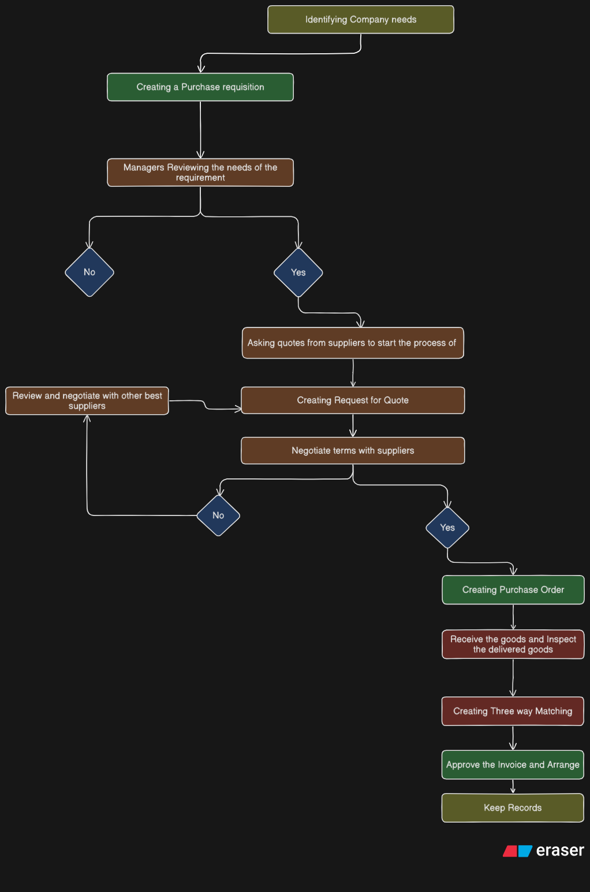

## Procurement process

Procurement process is a process in the end-to-end business process of obtaining goods and services that a company needs or day-to-day operations. It includes

* Identifying requirements
* Selecting suppliers
* negotiating contracts
* creating purchase requisitions
* purchase orders (PO)
* receiving and verifying goods
* approving supplier payments

Procurement is a vital business function that, when well executed, can help increase a business's profitability.
It includes raw materials and services, negotiating terms, tracking when suppliers are received, and maintaining records.
It's important to continuously monitor and assess the procurement process to improve any weak spots or inefficiencies.

Purchasing is the subset of procurement

##### How does procurement works

* Identifying the goods and/or services needed
* Sourcing suppliers, requesting quotes, filling out PRs
* Negotiating terms and costs with suppliers
* Receiving the relevant items and submitting payment
* Evaluating supplier performance and maintaining records.

Procurement is an important step in business because it helps to find company a reliable supplier with competitivley priced goods and services that matches the company needs.

##### Types of procurement

1. Direct Procurement
2. Indirect procurement
3. Good procurement
4. Services procurement

#### Steps Procurement process include

1. Identifying which goods and services Company needs
2. Submit purchase request
3. Assess and select vendors
4. Negotitate Price and terms
5. Create a Purchase Order
6. Receive and inspect the delivered goods
7. Conduct three-way matching
8. Approve the invoice and arrange payment
9. keep records

---

1. Identifying the requirements (can be goods or serivces)
   First, a business must identify its requirements for a specific item or a service. This may be a new item that the company hasn't previously purchased or restock of exsisting goods.
2. Submit Purchase request or requisition
   when a business requires any material or services it submit a formal PR(Purchase requisition) and this doesn't goes into accounting. Its for managers or the person responsible for approving the requirement.
3. Assess and Select Vendors
   Vendor selections going into this process to approved PR, now is the time to find the best vendor and submit a `Submit a request for quote (RFQ)` this is what purchasing teams sends to potential suppliers in order to receive a quote.
4. Negotiate Price and Terms
   A comman best practice to get the best quotes from suppliers before making a decision. Examine each quote carefully and negotiate where possible.
5. Create a Purchase Order
   Fill out a PO and send it to supplier. The PO should be sufficiently detailed to identitfy the exact goods needed and to enable the supplier to fill the order. Also ensure that the PO has the necessary approvals and proper accounting information for internal tracking.
6. Receive and Inspect the Delivered Goods
   Carefully examine deliveries for any errors or damage. Make sure everything is delivered as specified in the PO and that the quality meets or exceeds expectations. Ensure that receiving documentation is accurate and that any returns or rejections are clearly documented.
7. Conduct Three-Way Matching
   Accounts payable should conduct three-way matching by comparing the PO, order receipt or packing list, and invoice.
   The goal is to make certain the goods or services received match what was ordered and to prevent payment for unauthorized or inaccurate invoices.
   Highlight any discrepancies among the three documents and resolve issues before arranging payment.
8. Approve the Invoice and Arrange Payment
   If the three-way match is accurate, approve and pay the invoice.
9. Keep Records

